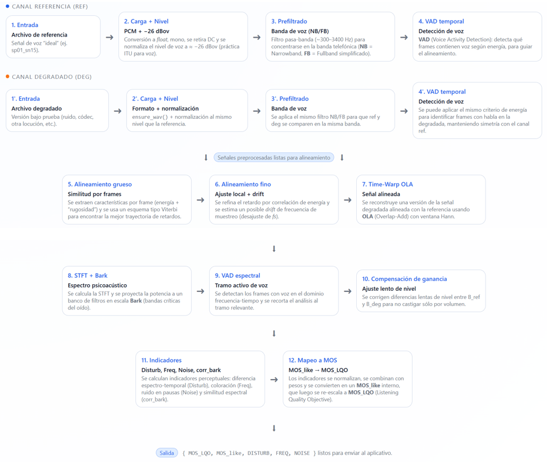

# POLQA educativo en Python (modelo MOS_LQO)

Implementación **educativa** inspirada en **ITU-T P.863 (POLQA)** para estimar la calidad de voz
en términos de **MOS_LQO (Listening Quality Objective)**, a partir de un par de señales:

- **Referencia (`ref`)**: señal “ideal”.
- **Degradada (`deg`)**: señal bajo prueba (ruido, códec, canal, etc.).

> ⚠️ Aviso  
> Este proyecto está inspirado en la arquitectura de ITU-T P.863, pero **no es** POLQA oficial
> ni pretende reemplazar herramientas certificadas. Se publica para fines académicos
> y experimentales.

---

## Características principales

- Implementado en **Python 3**.
- Acepta varios formatos de audio (WAV, OGG, MP3, etc.) usando `ffmpeg`.
- Normaliza el nivel de voz a ≈ **−26 dBov**.
- Alineamiento temporal **grueso + fino** entre referencia y degradada:
  - VAD (Voice Activity Detection) por energía.
  - Estimación de drift de frecuencia de muestreo.
  - Reconstrucción alineada mediante **OLA (Overlap-Add)**.
- Análisis psicoacústico:
  - STFT + banco de filtros en escala **Bark**.
  - Gating de voz en el dominio tiempo-frecuencia.
- Indicadores perceptuales:
  - `disturb`: diferencia espectro-temporal.
  - `freq`: coloración espectral.
  - `noise`: ruido en pausas.
  - `corr_bark`: similitud espectral global.
- Mapeo perceptual propio:
  - Indicadores normalizados → `MOS_like` → **`MOS_LQO`** (1 a ~4.5).

## Diagrama de bloques de la implementación del algoritmo

  

  <em>
    Figura 1: Diagrama de bloques de la implementación educativa del modelo tipo POLQA en Python, 
    que muestra el flujo desde las señales de referencia y degradada hasta el cálculo del MOS_LQO.
  </em>

## Requisitos de instalación en Python

Para ejecutar el script `polqa.py` se requiere:

- Python **3.8** o superior
- Librerías de Python:
  - `numpy`
  - `scipy`
  - `soundfile` (opcional pero recomendada)
- **ffmpeg** instalado y accesible desde la variable de entorno `PATH`  
  (necesario para leer formatos no-WAV como OGG, MP3, etc.)

Instalación de las librerías en Python:

pip install numpy scipy soundfile
choco install ffmpeg

## Uso del archivo polqa.py
Modo fullband
- python polqa.py ref.wav deg.wav --mode fb
Modo narrowband
- python polqa.py ref.wav deg.wav --mode nb

